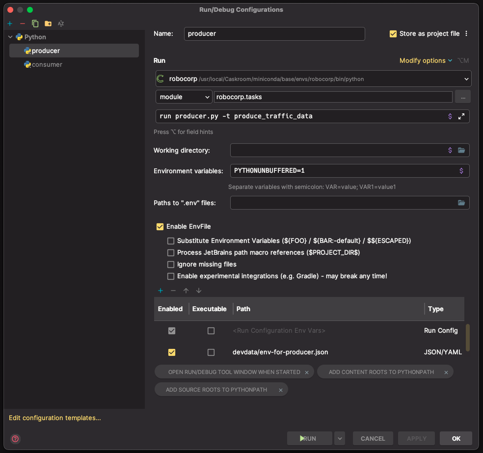

<div id="top"></div>

<!-- PROJECT SHIELDS -->
[![Contributors][contributors-shield]][contributors-url]
[![Forks][forks-shield]][forks-url]
[![Stargazers][stars-shield]][stars-url]
[![Issues][issues-shield]][issues-url]
[![MIT License][license-shield]][license-url]
<!-- END OF PROJECT SHIELDS -->

<!-- PROJECT LOGO -->
<br />
<div align="center">
    <a href="#">
        
    </a>
    <h3 ><a href="https://robocorp.com/docs/courses">Robocorp Certifications</a></h3>
</div>

## About The Project

This is the repository that contains the robots for the different levels of certification.

## Getting started

In the tutorials it is recommended to use [Visual Studio Code](https://code.visualstudio.com/) as the IDE.
But it is possible to use any other IDE (e.g. *PyCharm*).
These IDEs lacks some of the practical commands of Visual Studio Code,
but you can use the [rcc](https://robocorp.com/docs/rcc/overview) command line tool to do this.

1. [RCC](#rcc)
2. [Conda](#conda)
3. [PyCharm](#pycharm)

## RCC

In the following sections you will find some useful tips on how to set up and use `rcc`.

### Installation

```shell
# MacOS
brew install robocorp/tools/rcc
```

### Autocompletion in ZSH

1. If there is no directory the environment variable `FPATH` add one
   1. Create a directory in your home directory
   
      ```shell
      mkdir ~/.zfunc
      ```
      
   2. Open `~/.zshrc` in your favorite editor and add the following line
   
      ```text
      fpath=(~/.zfunc $fpath)
      ```

2. Create the autocompletion script

   ```shell
   rcc completion > ~/.zfunc/_rcc
   ```
   
3. Make the script executable

   ```shell
   chmod +x ~/.zfunc/_rcc
   ```

4. Reload your shell

   ```shell
   exec zsh
   ```

### Login to Control Room

```shell
rcc login
```

### Create a new robot project

Enter the following command in the terminal and follow the instructions.

```shell
rcc create
```

### Upload a robot to Control Room

1. Ensure that you are in the root directory of the robot project and enter the following command in the terminal

   ```shell
   rcc robot wrap
   ```
   
2. Push the robot to Control Room

   ```shell
   rcc push
   ```
   
## Conda

### Installation

```shell
# MacOS
brew install miniconda
conda init "$(basename "${SHELL}")"
```

### Create a new environment

If you used `rcc` to create a new robot project, you can use the `conda.yaml` file to create a new environment.

```shell
conda env create -f conda.yaml -n <your-conda-env>
```

## PyCharm

### Setup `conda` as the **Python Interpreter**

Open your robot project in PyCharm and add new **Python Interpreter**
1. `PyCharm` > `Settings`
2. `Project: <your-project-name>` > `Python Interpreter`
3. `Add Interpreter` > `Add Local Interpreter...`
4. Select `Conda Environment` > `Existing environment`
5. Select `<your-conda-env>` as the existing environment

### Setup Run Configurations

1. Install `EnvFile` plugin for using JSON files instead of .env files
   > Note: Dependent on the template you used while creating the project with `rcc` there might already be some
   > environment variables under `/devdata`.
   > These environment variables are stored in a JSON file.

2. Add a Run Configuration

   > ❗️You can find the necessary information for the *Run Configurations* in the `robot.yaml` file created by `rcc`.❗

   > Note: You can find the *Run Configurations* under `.run` in the respective project folders.
   
   <p>
      <br>
      <em>Example of a Run Configuration</em>
   </p>


<p align="right">(<a href="#top">back to top</a>)</p>

<!-- MARKDOWN LINKS & IMAGES -->
<!-- https://www.markdownguide.org/basic-syntax/#reference-style-links -->

[contributors-shield]: https://img.shields.io/github/contributors/Miragon/robocorp-cetification.svg?style=for-the-badge

[contributors-url]: https://github.com/Miragon/robocorp-certification/graphs/contributors

[forks-shield]: https://img.shields.io/github/forks/Miragon/robocorp-certification.svg?style=for-the-badge

[forks-url]: https://github.com/Miragon/robocorp-certification/network/members

[stars-shield]: https://img.shields.io/github/stars/Miragon/robocorp-certification.svg?style=for-the-badge

[stars-url]: https://github.com/Miragon/robocorp-certification/stargazers

[issues-shield]: https://img.shields.io/github/issues/Miragon/robocorp-certification.svg?style=for-the-badge

[issues-url]: https://github.com/Miragon/robocorp-certification/issues

[license-shield]: https://img.shields.io/github/license/Miragon/robocorp-certification.svg?style=for-the-badge

[license-url]: https://github.com/Miragon/robocorp-certification/blob/main/LICENSE
